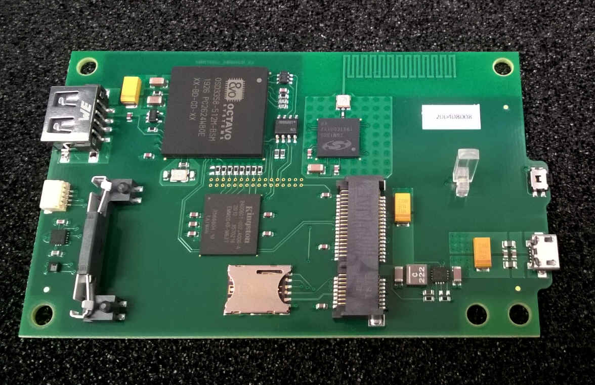

# Nerves System for the SmartRent Hub (OSS)

This is the base Nerves System configuration for the [SmartRent
Hub](http://smartrent.com/) used with public trainings and open source purposes.

| Feature              | Description                     |
| -------------------- | ------------------------------- |
| CPU                  | 1 GHz ARM Cortex-A8             |
| Memory               | 512 MB DRAM                     |
| Storage              | MicroSD                         |
| Linux kernel         | 5.10 w/ BBB patches             |
| IEx terminal         | ttyS0 via the FTDI connector    |
| UART                 | Z-Wave @ttyS4                   |
| USB                  | Two host interfaces - LTE and WiFi |
| I2C                  | i2c-1 to PMIC to ATECC608A      |
| Ethernet             | No                              |
| LEDs                 | Red/green LEDs exposed via /sys/class/leds |

## Console access

The console is configured to output to `ttyS0`. This can be accessed by soldering
wires onto test points on the underside of the board.

TODO: show where

## Device tree overlays

This system does not enable or use device tree overlays. All device tree
configuration for the hub is in the main device tree file -
`am335x-smartrent.dts`

## WiFi

TODO

